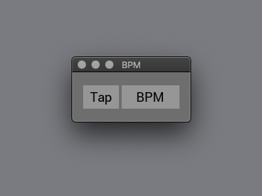

## Tap Tempo



A Tap Tempo app written in ReasonML.


### Keyboard shortcuts
  - `ESC` or `q` quit app
  - `SPACE` tap tempo

### Development

```
esy install       # install dependencies
esy run           # build and run the app
esy format        # run refmt on source files
```
