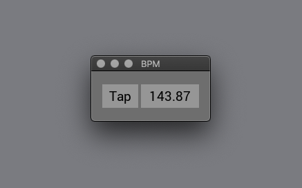

## Tap Tempo



A Tap Tempo app written in ReasonML.


### Download
[macOS v0.0.1](https://github.com/rudolfs/tap/releases/download/0.0.1/TapBPM.dmg)


### Keyboard shortcuts
  - `ESC` or `q` quit app
  - `SPACE` tap tempo


### Development

```
esy install       # install dependencies
esy run           # build and run the app
esy format        # run refmt on source files

yarn dist         # build macOS package
```
